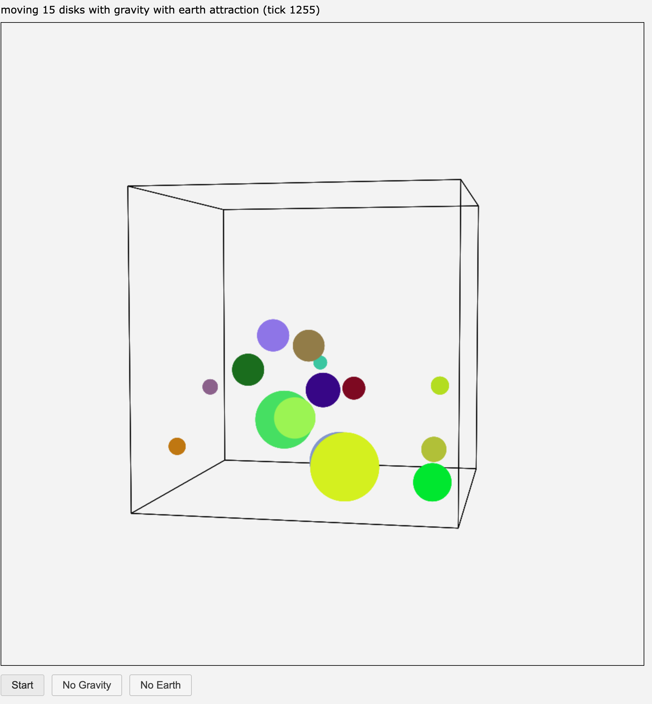

# qdsimviz
Quick and dirty experimental visual simulations.



## Development

Install in editable mode with test dependencies:

```bash
pip install -e ".[test]"
```

Run tests with:

```bash
pytest
```

